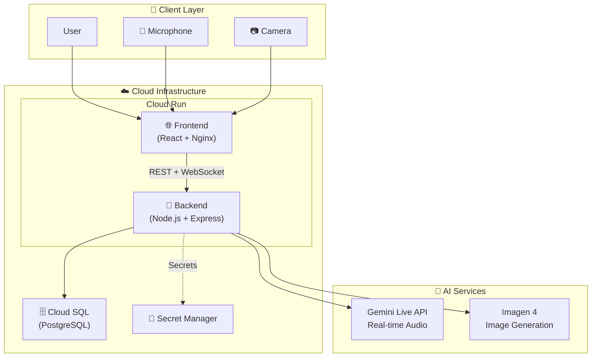
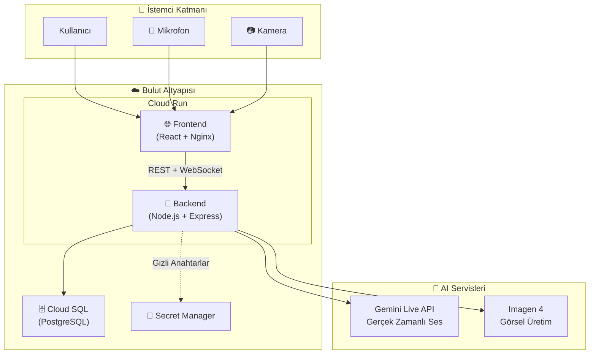

# Nöra - Cognitive Screening AI Assistant

> Real-time voice-visual interactive pre-screening AI agent for Alzheimer's and cognitive decline risk.

**🌐 Language / Dil:** [English](#english) | [Türkçe](#türkçe)

---

<a name="english"></a>

## 📋 Submission Links

| Submission | URL |
|---|---|
| **Public Repository** | https://github.com/knowhycodata/knowhy_genaizurich_v2 |
| **Live Demo** | https://nora-frontend-806414321712.us-central1.run.app |
| **Backend API** | https://nora-backend-806414321712.us-central1.run.app |
| **Demo Video** | https://youtu.be/g4qbj08f-Ls |

---

## 💡 Inspiration

Early-stage cognitive decline — including Alzheimer's disease — is notoriously difficult to detect. Most people only seek medical help after symptoms become severe and largely irreversible. Traditional clinical screenings are expensive, require trained personnel, and are inaccessible to millions. We asked: **what if an AI agent could conduct a preliminary cognitive screening through natural voice conversation — accessible to anyone, anywhere, at any time?**

Nöra was born from the intersection of applied Generative AI and a deep societal need. We wanted to prove that real-time multimodal AI can go beyond chatbots and content generation — it can genuinely assist in healthcare.

---

## 🧠 What It Does

Nöra is an autonomous voice AI agent that conducts a structured cognitive screening session with the user through natural conversation. It administers **4 clinically-inspired cognitive tests**:

1. **Verbal Fluency Test** — The user names as many words as possible in a category within a time limit
2. **Story Recall Test** — A dynamically generated story is told; the user retells it from memory
3. **Visual Recognition Test** — AI-generated images (via Imagen 4) are shown; the user identifies objects
4. **Orientation Test** — Time, date, and spatial awareness questions with real-time camera analysis

At the end, Nöra produces a **risk assessment score** and a **downloadable PDF report** with per-test breakdowns.

---

## 🛠️ How We Built It

- **Gemini Live API** for real-time, interruptible voice conversation via WebSocket proxy
- **Imagen 4** for dynamic test image generation (each session is unique)
- **Multi-agent architecture**: 5 coordinated agents (Nöra, BrainAgent, VisualTestAgent, DateTimeAgent, VideoAnalysisAgent + CameraPresenceAgent)
- **Deterministic scoring** — the LLM collects data via tool calling; all score calculations happen algorithmically in the backend (zero hallucination risk in scoring)
- **React + Vite + TailwindCSS** frontend with AudioWorklet for low-latency audio streaming
- **Node.js + Express + Prisma** backend with PostgreSQL
- **Cloud Run** deployment with automated IaC scripts and CI/CD pipeline

---

## 🧗 Challenges We Ran Into

1. **LLM Hallucination in Scoring** — Early experiments showed the AI miscalculating test scores. We solved this by implementing deterministic scoring: the AI only collects data via tool calling, and all calculations happen algorithmically in the backend.

2. **WebSocket Proxy Architecture** — Browsers cannot directly connect to the Gemini WebSocket endpoint due to CORS constraints. We built a Node.js WebSocket proxy that maintains sessions server-side while streaming audio to/from the client.

3. **Audio Pipeline Complexity** — Real-time audio streaming required careful handling of PCM encoding, sample rates, and buffer sizes. We used AudioWorklet (not the deprecated ScriptProcessorNode) for low-latency capture and playback.

4. **Multi-Agent Coordination** — Managing 5 concurrent agents required careful state synchronization. We solved race conditions by implementing a centralized state machine in BrainAgent.

5. **Timer Management** — LLMs have no reliable sense of time. We moved timer logic entirely to BrainAgent with server-side `setTimeout`, injecting timer events as text messages.

6. **Dynamic Content Generation** — Static test content would allow memorization. We integrated Gemini for real-time story generation and Imagen 4 for dynamic image generation, ensuring each session is unique.

---

## 🏆 Accomplishments That We're Proud Of

- **Zero-hallucination scoring** — By separating AI data collection from algorithmic computation, we achieved fully reliable test scoring
- **True real-time voice agent** — Sub-second latency voice conversation with interrupt support, not a turn-based chatbot
- **5-agent orchestration** — A sophisticated multi-agent system coordinated through a central state machine
- **Dynamic test content** — Every session generates unique stories and images, preventing memorization
- **Production-ready deployment** — Live, working application deployed on cloud infrastructure with IaC automation
- **Genuine societal impact** — A tool that could democratize access to cognitive screening worldwide

---

## 📚 What We Learned

- Real-time voice AI requires explicit, detailed system instructions to maintain consistent behavior across long sessions
- Tool Calling works well for structured data collection but requires sanitization to prevent session instability from malformed JSON
- Session affinity is essential for WebSocket-based applications in cloud environments
- Multi-language support in voice agents requires careful prompt engineering — language behavior must be anchored in the system instruction
- Separating AI reasoning from deterministic computation is the key to reliable AI-powered assessments

---

## 🔮 What's Next for Nöra

- **Clinical validation** — Partner with neurologists and research institutions to validate screening accuracy against established tests (MoCA, MMSE)
- **Longitudinal tracking** — Allow users to retake screenings over time and detect trends in cognitive health
- **Additional test modules** — Expand beyond 4 tests: attention span, executive function, spatial reasoning
- **Multilingual expansion** — Add support for German, French, Arabic, and other languages for global reach
- **Caregiver dashboard** — Allow family members or healthcare providers to monitor screening results
- **Mobile app** — Native mobile experience for broader accessibility
- **On-device processing** — Explore edge AI for privacy-sensitive deployments

---

## 🔧 Built With

- Gemini Live API, Imagen 4, Google GenAI SDK
- React, Vite, TailwindCSS, Lucide
- Node.js, Express, Prisma, PostgreSQL
- WebSocket, AudioWorklet
- Docker, Cloud Run, Cloud SQL, Secret Manager
- PDFKit, JWT, Helmet, express-validator

---

## ️ Architecture


<details>
<summary>Mermaid Source (click to expand)</summary>



</details>

---

## 📁 Project Structure

```text
nora/
├── packages/
│   ├── frontend/          # React + Vite + TailwindCSS
│   └── backend/           # Node.js + Express + Prisma
├── deploy.sh/ps1          # IaC: Automated deploy script
├── cloudbuild.yaml        # IaC: Cloud Build CI/CD pipeline
├── docker-compose.yml     # Local development
├── .env.example           # Environment variables template
└── README.md
```

---

## 🚀 Quick Start (Local)

### Prerequisites

| Requirement | Version |
|---|---|
| Node.js | 20+ |
| Docker & Docker Compose | Latest |
| Google Gemini API Key | - |

### Installation

```bash
# 1. Clone the repo
git clone https://github.com/knowhycodata/knowhy_gemini_live_agent_challange.git
cd knowhy_gemini_live_agent_challange

# 2. Set environment variables
cp .env.example .env
# Add your GOOGLE_API_KEY and JWT_SECRET to .env

# 3. Install dependencies and prepare database
npm install
npm run db:migrate
npm run db:seed

# 4. Start the application
npm run dev
```

### Alternative: Docker Compose

```bash
docker-compose up -d
```

### Local URLs

| Service | URL |
|---|---|
| Frontend | http://localhost:5173 |
| Backend | http://localhost:3001 |
| Health Check | http://localhost:3001/api/health |

### Demo Account

| Field | Value |
|---|---|
| Email | `demo@nora.ai` |
| Password | `demo123` |

---

## ☁️ Cloud Deploy

### Method 1: Automated Deploy Script

**File:** [`deploy.sh/ps1`](deploy.sh/ps1)

Sets up entire cloud infrastructure with a single command:

```bash
# 1. Prerequisites
gcloud auth login

# 2. Set env vars
export GCP_PROJECT_ID="YOUR_PROJECT_ID"
export GCP_REGION="us-central1"
export GOOGLE_API_KEY="YOUR_GOOGLE_API_KEY"
export JWT_SECRET="YOUR_JWT_SECRET"
export DB_PASSWORD="STRONG_DB_PASSWORD"

# 3. Run deploy script
bash deploy.sh
```

The script automatically:
- Enables required APIs
- Creates Artifact Registry
- Sets up Cloud SQL (PostgreSQL 16)
- Writes secrets to Secret Manager
- Builds Backend and Frontend Docker images
- Deploys both services to Cloud Run
- Updates CORS settings
- Performs health check

### Method 2: Cloud Build CI/CD

**File:** [`cloudbuild.yaml`](cloudbuild.yaml)

CI/CD pipeline with automatic trigger from GitHub:

```bash
# Manual trigger
gcloud builds submit --config=cloudbuild.yaml .
```

### Deployed Services

| Service | URL | Status |
|---|---|---|
| **Frontend** | https://nora-frontend-806414321712.us-central1.run.app | ✅ Active |
| **Backend** | https://nora-backend-806414321712.us-central1.run.app | ✅ Active |
| **Health Check** | https://nora-backend-806414321712.us-central1.run.app/api/health | ✅ 200 OK |

---

## 🔐 Security & Design Decisions

| Decision | Description |
|---|---|
| **Deterministic Scoring** | LLM does not calculate scores; all scores are computed algorithmically in backend |
| **JWT Authentication** | Token-based auth with rate limiting |
| **Input Validation** | All inputs validated with express-validator |
| **Tool Calling Sanitization** | Tool call results sanitized for live session stability |

---

## 📄 License

This project is open source, developed for the GenAI Zürich Hackathon 2026.

---

---

<a name="türkçe"></a>

# Nöra - Bilişsel Tarama AI Asistanı

> Alzheimer ve bilişsel bozulma riski için gerçek zamanlı sesli-görsel etkileşimli ön tarama AI ajanı.

---

## 📋 Teslim Linkleri

| Teslim | URL |
|---|---|
| **Public Repository** | https://github.com/knowhycodata/knowhy_genaizurich_v2 |
| **Live Demo** | https://nora-frontend-806414321712.us-central1.run.app |
| **Backend API** | https://nora-backend-806414321712.us-central1.run.app |
| **Demo Video** | https://youtu.be/g4qbj08f-Ls |

---

## 💡 İlham

Erken evre bilişsel gerileme — Alzheimer dahil — tespit edilmesi son derece zor bir durumdur. Çoğu insan ancak belirtiler ciddi ve büyük ölçüde geri döndürülemez hale geldikten sonra tıbbi yardım arar. Geleneksel klinik taramalar pahalı, eğitimli personel gerektiren ve milyonlarca kişi için erişilmez süreçlerdir. Biz sorduk: **Ya bir AI ajanı doğal sesli konuşma yoluyla ön bilişsel tarama yapabilseydi — herkes için, her yerde, her zaman erişilebilir olsaydı?**

Nöra, uygulamalı Üretken AI ile derin bir toplumsal ihtiyacın kesişim noktasında doğdu. Gerçek zamanlı multimodal AI'ın sohbet botları ve içerik üretiminin ötesine geçebileceğini — sağlık alanında gerçek bir fayda sağlayabileceğini kanıtlamak istedik.

---

## 🧠 Ne Yapar?

Nöra, kullanıcı ile doğal konuşma yoluyla yapılandırılmış bir bilişsel tarama oturumu yürüten otonom bir sesli AI ajanıdır. **4 klinik ilhamlı bilişsel test** uygular:

1. **Sözel Akıcılık Testi** — Kullanıcı belirli bir süre içinde bir kategoride mümkün olduğunca çok kelime söyler
2. **Hikaye Hatırlama Testi** — Dinamik olarak üretilen bir hikaye anlatılır; kullanıcı hafızadan geri anlatır
3. **Görsel Tanıma Testi** — AI tarafından üretilen görseller (Imagen 4) gösterilir; kullanıcı nesneleri tanımlar
4. **Yönelim Testi** — Zaman, tarih ve mekansal farkındalık soruları, gerçek zamanlı kamera analizi ile

Oturumun sonunda Nöra bir **risk değerlendirme skoru** ve test bazında ayrıntılı **indirilebilir PDF rapor** üretir.

---

## 🛠️ Nasıl İnşa Ettik?

- **Gemini Live API** ile gerçek zamanlı, kesintiye dayanıklı sesli konuşma (WebSocket proxy üzerinden)
- **Imagen 4** ile dinamik test görseli üretimi (her oturum benzersiz)
- **Multi-agent mimarisi**: 5 koordineli ajan (Nöra, BrainAgent, VisualTestAgent, DateTimeAgent, VideoAnalysisAgent + CameraPresenceAgent)
- **Deterministik skorlama** — LLM tool calling ile veri toplar; tüm skor hesaplamaları backend'de algoritmik olarak yapılır (skorlamada sıfır halüsinasyon riski)
- **React + Vite + TailwindCSS** frontend, düşük gecikmeli ses akışı için AudioWorklet
- **Node.js + Express + Prisma** backend, PostgreSQL ile
- **Cloud Run** deployment, otomatik IaC scriptleri ve CI/CD pipeline

---

## 🧗 Karşılaştığımız Zorluklar

1. **LLM Halüsinasyonu ve Skorlama** — İlk denemelerde AI'ın test puanlarını yanlış hesapladığını gördük. Deterministik skorlama ile çözdük: AI yalnızca tool calling ile veri toplar, tüm hesaplamalar backend'de algoritmik olarak yapılır.

2. **WebSocket Proxy Mimarisi** — Tarayıcılar CORS kısıtlamaları nedeniyle Gemini WebSocket endpoint'ine doğrudan bağlanamaz. Sunucu tarafında oturumu yöneten bir Node.js WebSocket proxy inşa ettik.

3. **Ses Pipeline Karmaşıklığı** — Gerçek zamanlı ses akışı; PCM kodlama, örnekleme hızları ve buffer boyutlarının dikkatli yönetimini gerektirdi. AudioWorklet ile düşük gecikmeli ses yakalama sağladık.

4. **Multi-Agent Koordinasyonu** — 5 eşzamanlı ajanı yönetmek dikkatli durum senkronizasyonu gerektirdi. BrainAgent'ta merkezi bir durum makinesi uygulayarak yarış koşullarını çözdük.

5. **Zamanlayıcı Yönetimi** — LLM'lerin güvenilir bir zaman algısı yoktur. Zamanlayıcı mantığını tamamen BrainAgent'a taşıdık ve sunucu tarafı `setTimeout` ile yönettik.

6. **Dinamik İçerik Üretimi** — Statik test içeriği ezberlemeye olanak tanırdı. Gerçek zamanlı hikaye ve görsel üretimi ile her oturumu benzersiz kıldık.

---

## 🏆 Gurur Duyduğumuz Başarılar

- **Sıfır halüsinasyonlu skorlama** — AI veri toplama ile algoritmik hesaplamayı ayırarak tam güvenilir test skorlaması elde ettik
- **Gerçek zamanlı sesli ajan** — Kesinti destekli, saniyenin altında gecikmeli sesli konuşma; sıra tabanlı bir chatbot değil
- **5 ajanlı orkestrasyon** — Merkezi durum makinesi ile koordine edilen sofistike bir multi-agent sistemi
- **Dinamik test içeriği** — Her oturum benzersiz hikayeler ve görseller üretir, ezberlemeyi engeller
- **Production-ready deployment** — Bulut altyapısında canlı çalışan, IaC otomasyonlu uygulama
- **Gerçek toplumsal etki** — Bilişsel taramaya erişimi demokratikleştirebilecek bir araç

---

## 📚 Öğrendiklerimiz

- Gerçek zamanlı sesli AI, uzun oturumlarda tutarlı davranış için açık ve detaylı system instruction gerektirir
- Tool Calling yapılandırılmış veri toplama için iyi çalışır ancak hatalı JSON'dan kaynaklanan oturum kararsızlığını önlemek için sanitizasyon gerektirir
- Session affinity, bulut ortamlarında WebSocket tabanlı uygulamalar için zorunludur
- Sesli ajanlarda çok dilli destek, dikkatli prompt mühendisliği gerektirir — dil davranışı system instruction'da sabitlenmelidir
- AI muhakemesini deterministik hesaplamadan ayırmak, güvenilir AI değerlendirmelerinin anahtarıdır

---

## 🔮 Nöra'nın Geleceği

- **Klinik doğrulama** — Nörologlar ve araştırma kurumlarıyla tarama doğruluğunu test etme (MoCA, MMSE'ye karşı)
- **Uzunlamasına takip** — Kullanıcıların zaman içinde taramaları tekrarlayıp bilişsel sağlık trendlerini izlemesi
- **Ek test modülleri** — Dikkat süresi, yönetici işlev, uzamsal muhakeme testleri
- **Çok dilli genişleme** — Almanca, Fransızca, Arapça ve diğer diller için destek
- **Bakıcı paneli** — Aile üyeleri veya sağlık hizmeti sağlayıcılarının tarama sonuçlarını izlemesi
- **Mobil uygulama** — Daha geniş erişilebilirlik için yerel mobil deneyim

---

## 🔧 Kullanılan Teknolojiler

- Gemini Live API, Imagen 4, Google GenAI SDK
- React, Vite, TailwindCSS, Lucide
- Node.js, Express, Prisma, PostgreSQL
- WebSocket, AudioWorklet
- Docker, Cloud Run, Cloud SQL, Secret Manager
- PDFKit, JWT, Helmet, express-validator

---

## 🎯 Proje Özeti

Nöra, kullanıcı ile doğal konuşma akışında ilerleyen bir bilişsel tarama deneyimi sunar:

- **Gemini Live API** ile gerçek zamanlı sesli konuşma (kesintiye dayanıklı)
- **Imagen 4** ile görsel üretim ve tanıma testleri
- **Kamera analizi** ile odak, mimik, göz teması gözlemleri
- **Deterministik skorlama** — LLM hesaplamaz, backend algoritmaları hesaplar

### Özellikler

| Özellik | Açıklama |
|---|---|
| 🎤 Canlı Sesli Konuşma | AudioWorklet + WebSocket ile düşük gecikmeli akış |
| 🖼️ Görsel Test | Imagen 4 ile görsel üretim, tanıma testi |
| 📷 Kamera Analizi | Gerçek zamanlı davranış/odak analizi |
| 📊 Sonuç Ekranı | Test bazlı skorlar, risk durumu, PDF rapor |
| 🔐 Güvenlik | JWT auth, rate-limit, input validation |

---

## 🏗️ Mimari Diyagramı


<details>
<summary>Mermaid Kaynak Kodu (görmek için tıklayın)</summary>



</details>

---

## 📁 Proje Yapısı

```text
nora/
├── packages/
│   ├── frontend/          # React + Vite + TailwindCSS
│   └── backend/           # Node.js + Express + Prisma
├── deploy.sh/ps1          # IaC: Otomatik deploy scripti
├── cloudbuild.yaml        # IaC: Cloud Build CI/CD pipeline
├── docker-compose.yml     # Lokal geliştirme
├── .env.example           # Environment variables şablonu
└── README.md
```

---

## 🚀 Hızlı Başlangıç (Lokal)

### Ön Gereksinimler

| Gereksinim | Versiyon |
|---|---|
| Node.js | 20+ |
| Docker & Docker Compose | Latest |
| Google Gemini API Key | - |

### Kurulum

```bash
# 1. Repo'yu klonla
git clone https://github.com/knowhycodata/knowhy_gemini_live_agent_challange.git
cd knowhy_gemini_live_agent_challange

# 2. Environment variables ayarla
cp .env.example .env
# .env içine GOOGLE_API_KEY ve JWT_SECRET girin

# 3. Bağımlılıkları kur ve veritabanını hazırla
npm install
npm run db:migrate
npm run db:seed

# 4. Uygulamayı başlat
npm run dev
```

### Alternatif: Docker Compose

```bash
docker-compose up -d
```

### Lokal URL'ler

| Servis | URL |
|---|---|
| Frontend | http://localhost:5173 |
| Backend | http://localhost:3001 |
| Health Check | http://localhost:3001/api/health |

### Demo Hesap

| Alan | Değer |
|---|---|
| E-posta | `demo@nora.ai` |
| Şifre | `demo123` |

---

## ☁️ Bulut Deploy

### Yöntem 1: Otomatik Deploy Script

**Dosya:** [`deploy.sh/ps1`](deploy.sh/ps1)

Tek komutla tüm bulut altyapısını kurar:

```bash
# 1. Ön gereksinimler
gcloud auth login

# 2. Env vars ayarla
export GCP_PROJECT_ID="YOUR_PROJECT_ID"
export GCP_REGION="us-central1"
export GOOGLE_API_KEY="YOUR_GOOGLE_API_KEY"
export JWT_SECRET="YOUR_JWT_SECRET"
export DB_PASSWORD="STRONG_DB_PASSWORD"

# 3. Deploy scriptini çalıştır
bash deploy.sh
```

Script şunları otomatik yapar:
- Gerekli API'leri etkinleştirir
- Artifact Registry oluşturur
- Cloud SQL (PostgreSQL 16) kurar
- Secret Manager'a anahtarları yazar
- Backend ve Frontend Docker image'lerini build eder
- Her iki servisi Cloud Run'a deploy eder
- CORS ayarlarını günceller
- Health check yapar

### Yöntem 2: Cloud Build CI/CD

**Dosya:** [`cloudbuild.yaml`](cloudbuild.yaml)

GitHub'dan otomatik trigger ile CI/CD pipeline:

```bash
# Manuel tetikleme
gcloud builds submit --config=cloudbuild.yaml .
```

### Deploy Edilmiş Servisler

| Servis | URL | Durum |
|---|---|---|
| **Frontend** | https://nora-frontend-806414321712.us-central1.run.app | ✅ Aktif |
| **Backend** | https://nora-backend-806414321712.us-central1.run.app | ✅ Aktif |
| **Health Check** | https://nora-backend-806414321712.us-central1.run.app/api/health | ✅ 200 OK |

---

##  Güvenlik ve Tasarım Kararları

| Karar | Açıklama |
|---|---|
| **Deterministik Skorlama** | LLM skor hesaplamaz; tüm puanlar backend'de algoritmik olarak hesaplanır |
| **JWT Authentication** | Token-based auth, rate limiting uygulanır |
| **Input Validation** | express-validator ile tüm girdiler doğrulanır |
| **Tool Calling Sanitization** | Live session stabilitesi için araç çağrısı sonuçları sanitize edilir |

---

## 📄 Lisans

Bu proje GenAI Zürich Hackathon 2026 için geliştirilmiştir.
